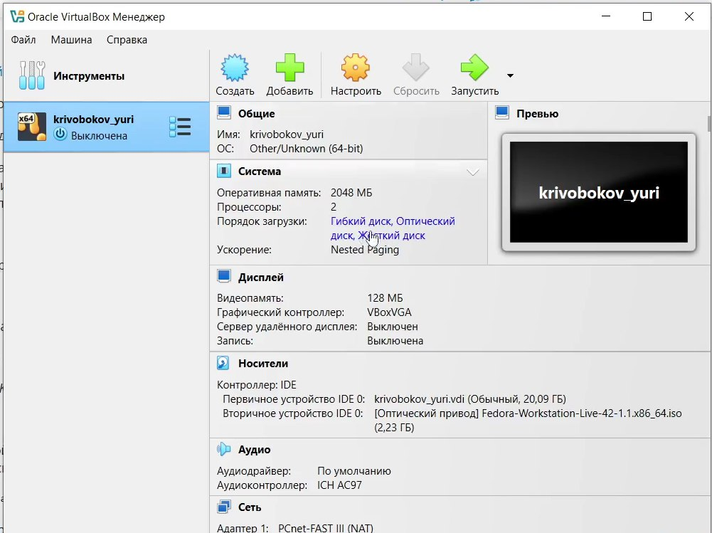
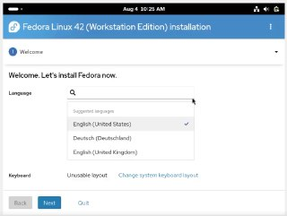
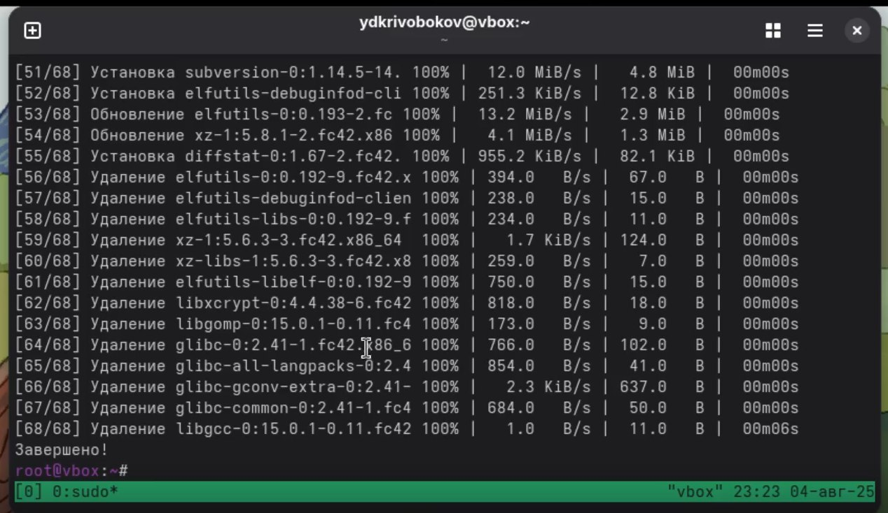

---
# Preamble

## Author
author:
  name: Кривобоков Юрий Дмитриевич
  degrees: DSc
  orcid: 0000-0002-0877-7063
  email: kulyabov-ds@rudn.ru
  affiliation:
    - name: Российский университет дружбы народов
      country: Российская Федерация
      postal-code: 117198
      city: Москва
      address: ул. Миклухо-Маклая, д. 6
## Title
title: "Отчёт по лабораторной работе №1"
subtitle: "Простейший вариант"
license: "CC BY"
## Generic options
lang: ru-RU
number-sections: true
toc: true
toc-title: "Содержание"
toc-depth: 2
## Crossref customization
crossref:
  lof-title: "Список иллюстраций"
  lot-title: "Список таблиц"
  lol-title: "Листинги"
## Bibliography
bibliography:
  - bib/cite.bib
csl: _resources/csl/gost-r-7-0-5-2008-numeric.csl
## Formats
format:
### Pdf output format
  pdf:
    toc: true
    number-sections: true
    colorlinks: false
    toc-depth: 2
    lof: true # List of figures
    lot: true # List of tables
#### Document
    documentclass: scrreprt
    papersize: a4
    fontsize: 12pt
    linestretch: 1.5
#### Language
    babel-lang: russian
    babel-otherlangs: english
#### Biblatex
    cite-method: biblatex
    biblio-style: gost-numeric
    biblatexoptions:
      - backend=biber
      - langhook=extras
      - autolang=other*
#### Misc options
    csquotes: true
    indent: true
    header-includes: |
      \usepackage{indentfirst}
      \usepackage{float}
      \floatplacement{figure}{H}
      \usepackage[RM={Scale=0.94},SS={Scale=0.94},SScon={Scale=0.94},TT={Scale=MatchLowercase,FakeStretch=0.9},DefaultFeatures={Ligatures=Common}]{plex-otf}
### Docx output format
  docx:
    toc: true
    number-sections: true
    toc-depth: 2
---

# Цель работы

Целью данной работы является приобретение практических навыков установки операционной системы на виртуальную машину, настройки минимально необходимых для дальнейшей работы сервисов.

# Задание

- Установка Linux на VirtualBox
- Установка необходимого ПО
- Первоначальная настройка ОС для дальнейшей работы

# Теоретическое введение

VirtualBox (Oracle VM VirtualBox) — программный продукт виртуализации, который позволяет запускать несколько гостевых операционных систем на одном компьютере под управлением основной (хостовой) системы.

# Выполнение лабораторной работы

Создаю виртальный жесткий диск и запускаю скачанный образ операционной системы. (рис. -@fig:001)

\ref{#fig:001 width=70%}

Через интерактивный установщик задаю базовые настройки для установки операционной системы. (рис. -@fig:002)

\ref{#fig:002 width=70%}

Продолжаю установку через интерактивный интерфейс. (рис. -@fig:003)

\ref{#fig:003 width=70%}

Скачиваю набор необходимых пакетов для работы с ОС. (рис. -@fig:004)

\ref{#fig:004 width=70%}

Продолжаю установку пакетов. (рис. -@fig:005)

\ref{#fig:005 width=70%}

Скачиваю необходимые ресурсы для работы Пандок. (рис. -@fig:006)

\ref{#fig:006 width=70%}

# Выводы

В ходе выполнения лабораторный работы приборел навыки установки виртуальной машины на Qemu, установил ряд пакетов и настроил ОС для дальнейшей работы на ней.

# Список литературы{.unnumbered}

::: {#refs}
:::
